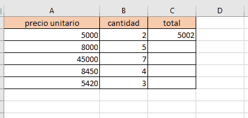
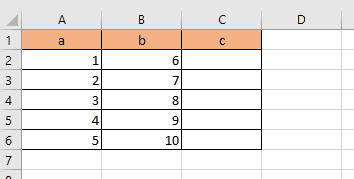

# Formulas

las formulas en excel nos permiten hacer un calculo matematico, de la misma forma que se haria con lapiz y papel.

lo primero que debemos hacer es colocarnos en la celda donde queremos que aparezca el calculo de la formula.

lo primero que debemos hacer es colocar el simbolo igual (=) para que excel sepa que queremos ingresar una formula.

Ejemplo:

```excel
=a2+b2
```

cuando se quiere modificar la formula se puede hacer desde la barra de formulas o usar `f2` para que nos permita modificar la formula desde la celda que la contiene.


## notas

se puede usar la propiedad de relleno para arrastrar la formula con doble click cuando cambia el mouse a una cruz negra pequeña, teniendo presente que cuando encuentra una fila vacia este cortaria la formula. 

toca copiar la formula en la celda vacia y volver a arrastrar la formula.



tambien se puede rellenar los campos si se selecciona un rango primero y luego se escribe la formula, una vez que se termine la formula se da `ctrl`+`enter` y el rango sera rellenado con la formula.

