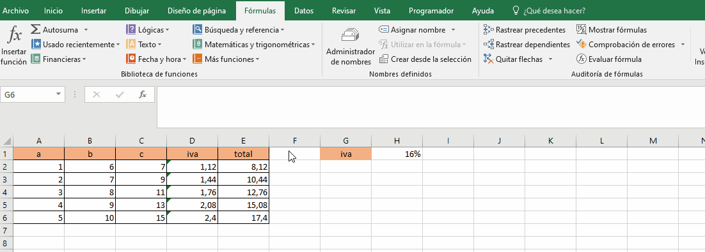
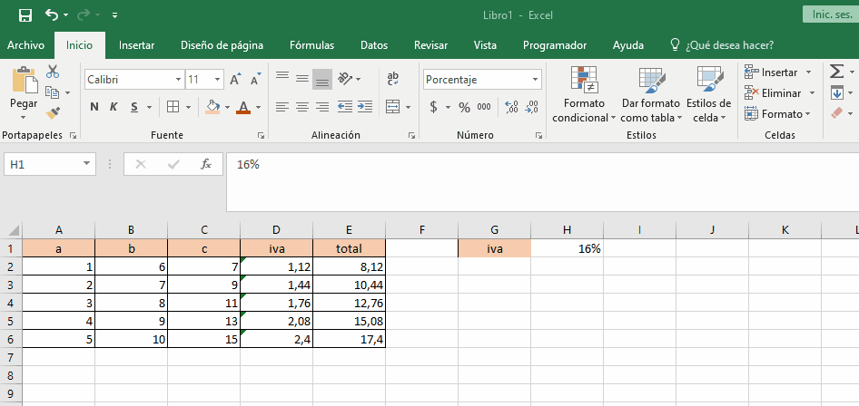
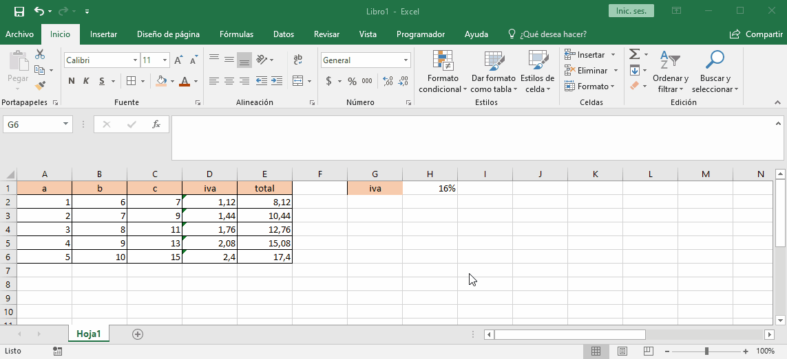
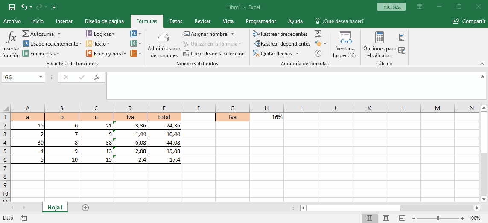

# auditoria

## Precedentes
Este comando nos permite ver que celdas interactuan para crear el resultado de la celda que estamos evaluando.

## Dependientes
 Este comando nos pernite ver que celdas dependen de la celda evaluada para saber que hacer

 

## Inspeccion

la inpeccion nos permite colocar celdas que no alcanzamos a ver en pantalla en un cuadro flotante, para ver como cambia esos valores con las modificaciones que hacemos.

## Evaluacion de formulas

la evaluacion de formulas nos permite hacer una evaluacion de datos de una formula paso a paso para saber los valores que esta tomando y como esta operando esos datos.

