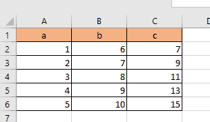
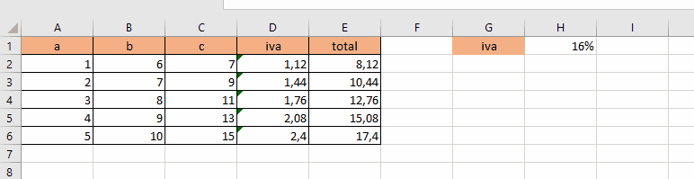

# Referencias

son los nombres de las celdas que continen los valores a usar.

## referencias relativas

estas referencias son las que se mueven segun la celda en la que se encuentren funcion normal de las formulas.

## referencias fijas

Se trata de poner una columna, una fila o ambas de forma que estas no puedan cambiar si se mueve la formula.

para esto se debe colocar el simbolo dolar `$` dependiendo lo que queremos dejar fijo.

podemos hacer que excel nos ponga este simbolo aprimiendo `f4`

Ejemplos:

+ $B2: hace fija la columna (mixta)
+ B$2: hace fija la fila (mixta)
+ $B$2: hace fija la celda (absoluta)

