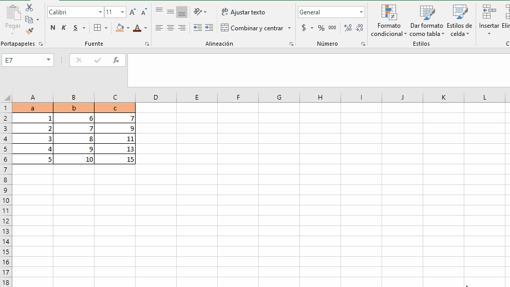

# transponer

lo que hace transponer es pivotear la tabla cambiando las columnas a filas y las filas a columnas.

para poder hacer esto se debe copiar la tabla que se quiere transponer y luego ya sea con las opciones de pegado o dando click derecho del mouse para dar la opcion de transponer.

