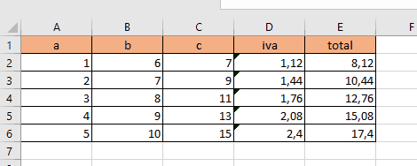

# seleccion de rangos

## primera forma

para seleccionar un rango de datos nos paramos en la primera celda de lo que queremos seleccionar y pulsamos `ctrl`+`shit`+`↓`+`→`

## forma contextual o region

la segunda forma es dejando que excel seleccione el rango donde hay datos con el comando `ctrl`+`*` parandonos en cualquier parte de la tabla donde esten los datos.

