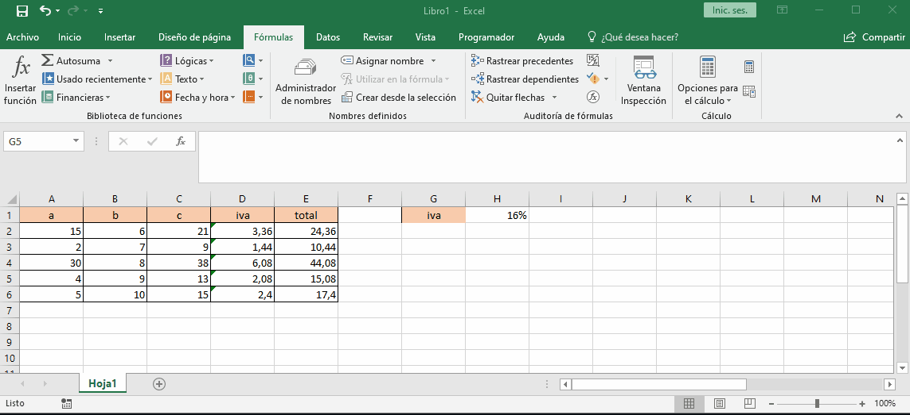
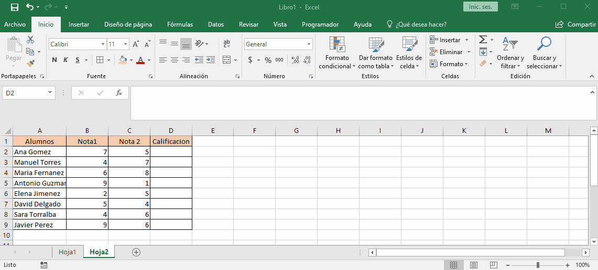
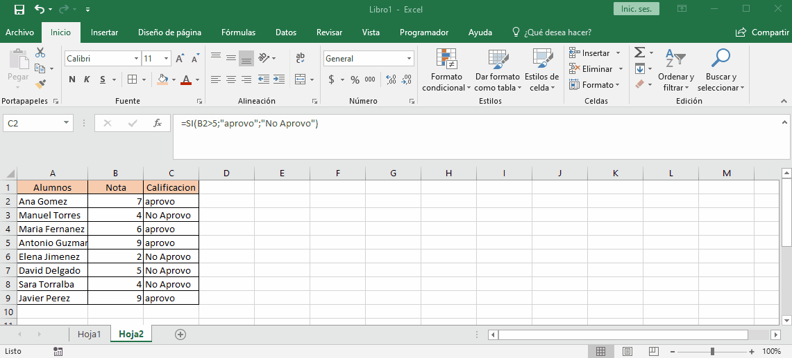

# asistente de funciones

para sacar el asistente de funciones podemos darle click a `fx` o ir a formulas e insertar. 

En el cuadro flotante que aparece podemos escribir lo que queremos hacer y le damos click a `ir` nos mostrara algunas funciones que pueden cumplir lo que queremos hacer. debemos leer las funciones que nos sugiere para saber si es la que necesitamos.

## asistente para funciones anidadas

el asistente de funciones se vuelve mas complejo de usar cuando queremos usar varias formulas en una celda pero podemos hacerlo si nos movemos desde el cuadro de dialogo al excel esto nos permitira abrir otra funcion en el mismo cuadro de dialogo y desde el visor de formulas podemos movernos de una funcion a otra para modificar sus respectivos valores.

## recuperar el asistente de funciones

para recuperar el asistente de funciones una vez que ya se inserto la formula debemos pararnos en la celda que tiene la funcion y darle click a insertar funcion este reconocera que la celda tiene una funcion y nos traera la funcion en el asistente.

