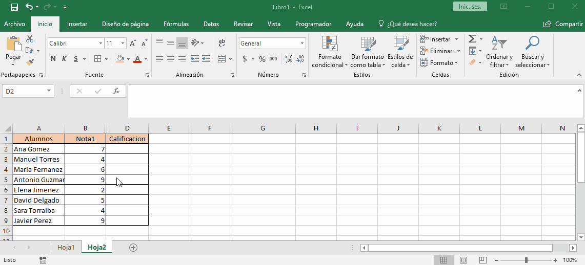
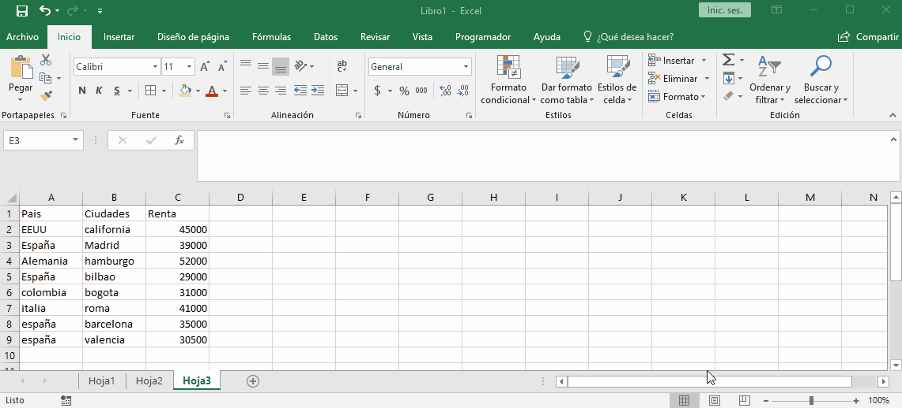

# si conjunto

nos permite agrupar condiciones mejorando la sintaxis de `si anidados`

ya que esta se basa en prueba logica y el valor a devolver cuando se cumpla.

sintaxis:

+ `si.conjunto(logica1;parte_verdadera[;logica2; parte_verdadera2;.....])`

# max y min si conjunto

nos permite encontrar el valor mas alto o mas bajo, con la condicion de un conjunto. 

sintaxis:

+ `max.si.conjunto(rango_de_valores; rango_de_criterios;criterio_buscar)`

