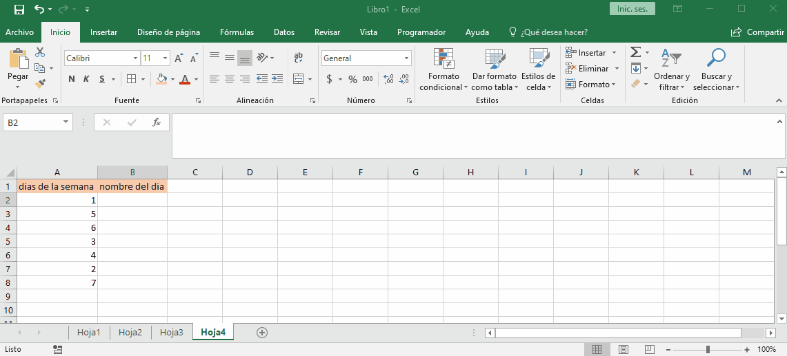

# cambiar

en algunos casos necesitamos cambiar un valor por otro y no es optimo usar funciones `si` para esto se creo cambiar que nos permite colocar un valor que se compara con una celda y luego el valor cambiado.

