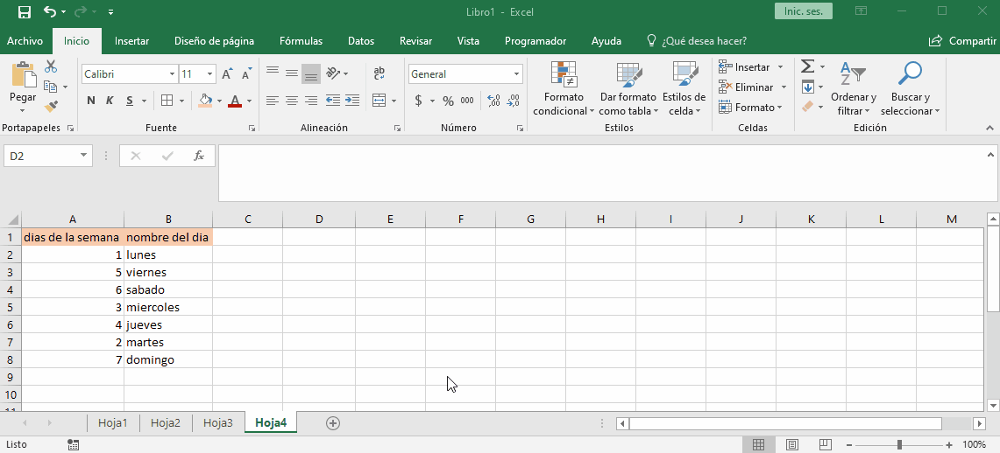

# concat y unir cadenas

excel tiene varias funciones para concatenar textos las cuales son:
+ concatenar(texto1;texto2[;texto3;...]) "obsoleta"
+ concat(rango)
+ unircadenas(separador;¿incluir_celdas_vacias?;rango)

