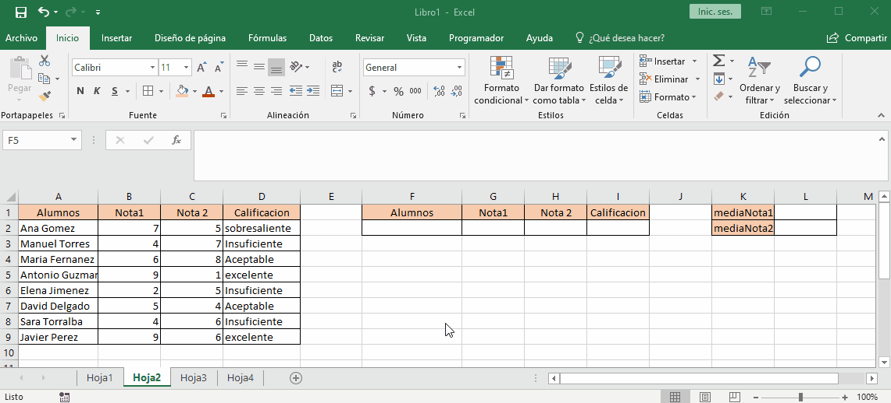

# base datos

las funciones de base de base de datos se debe crear una segunda tabla que contenga los mismos encabezados de la tabla base esto para crear busquedas o parametros de criterio. 

+ los criterios de la misma linea se interpretaran como si se evaluara con el operador logico `y`.
+ los criterios que van en diferente linea se tratan con el operador logico `o`
+ si se usa una tabla se debe colocar dos encabezados diferentes para que la funciones de base de datos funcionen. 
+ la tabla de creterios solo debe tener la cantidad de lineas que se usen si se dejan filas vacias traera todos los datos ya que se esta diciendo `o todo`

**NOTA**: las funciones de base de datos comienzan con `BD`
