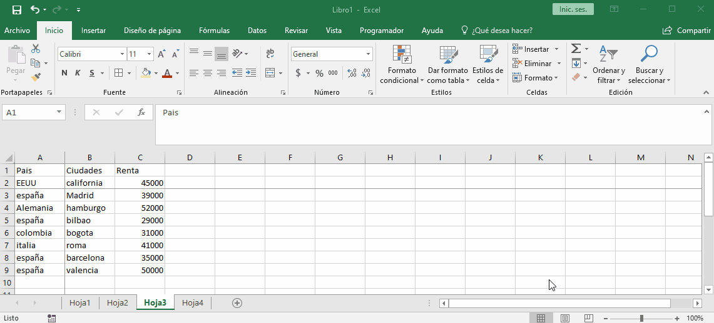
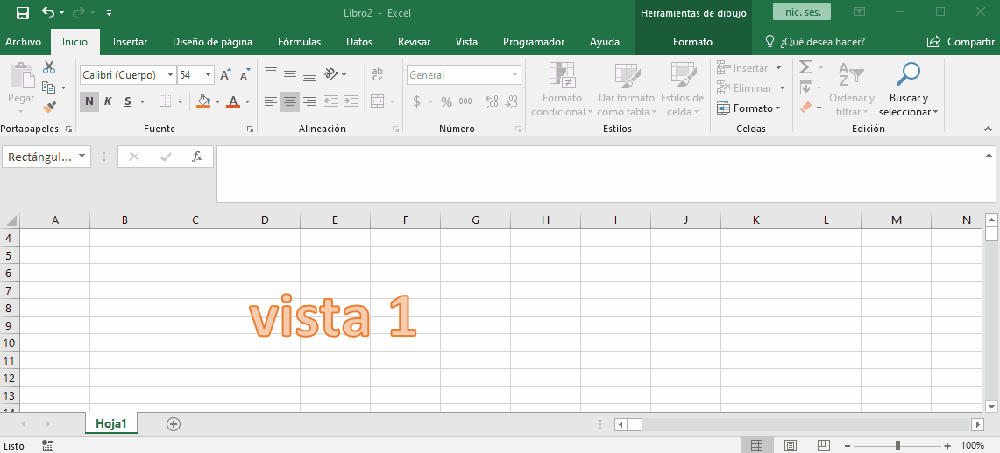
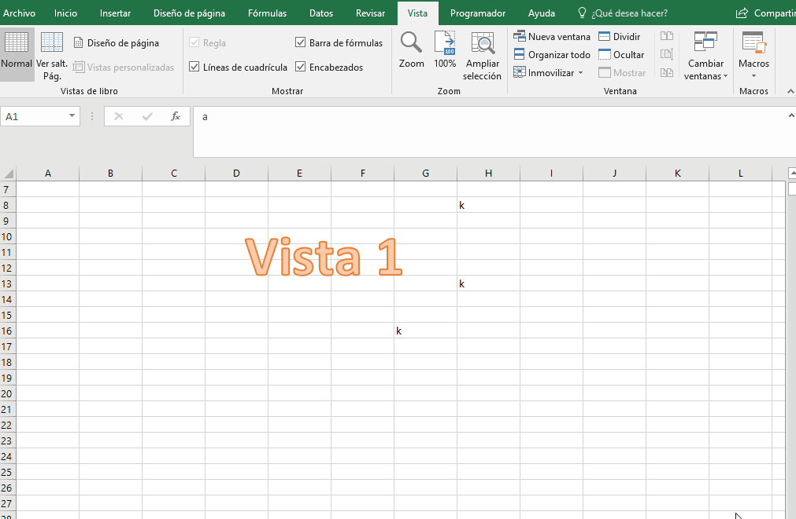
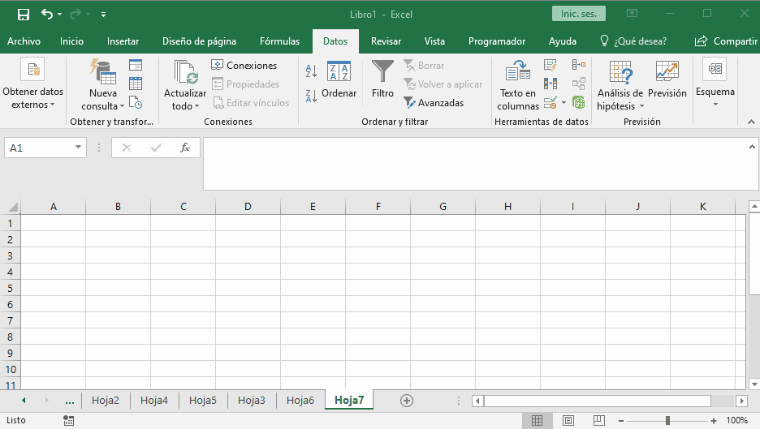

# hojas

lo primero que tenemos que aprender son las vistas que podemos configurar para que nuestros trabajo sea mas facil.

## inmovilizar paneles

podemos inmovilizar la primera fila, la primera columna, o varias filas y columnas con paneles

para llegar a esta propiedad debemos ir a `vita`, `inmovilizar` y seleccionamos una de las tres opciones.

## dividir hojas

nos permite tener la misma hoja separada en dos partes para mirar dos partes diferentes al mismo tiempo.

para lograr esto antes se debe posicionar en la fila que hara el corte visual y luego dar en dividir.

para llegar a esta propiedad es clic en `vista`, `dividir`

## vistas personalizadas

las vistas personalizadas nos permite movernos en una hoja de gran tamaño, donde comenzaremos a guardar la vista que queremos ver de forma rapida.

para llegar a esta propiedad se da click en `vista`, `vista personalizada`

## nueva venta

Esta propiedad sirve mucho cuando se quiere hacer formulas que usan diferentes hojas del mismo libro ya que en una ventana podemos tener la hoja de la formula y en la otra las demas hojas para estar moviendono en ellas.

+ divide de forma virtual un libro en varios.
+ se llega con `vista`, `nueva ventana`
+ se suele usar con `organizar todo` que tambien esta en la cinta `vista`

## consolidacion de datos

consolidar datos nos permite hacer operaciones con diferentes hojas teniendo encuenta que cada hoja tenga el mismo formato, para conservar la coerencia de la informacion. 

+ debemos paranos en la hoja donde queremos que se muestren los datos
+ cuando creamos vinculos con los datos de origenes nos muestra de donde vienen los datos y podemos desplegarlos dependiendo los niveles que se hubieran creado. 

