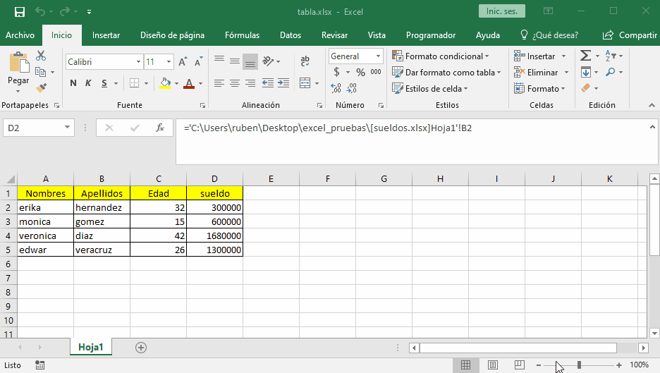

# libros

## vinculos

para crear un vinculo entre libros excel tiene la nomenclatura de entre parentesis poner la ruta del archivo y cuando se va a poner el nombre del archivo se debe poner entre corchetes con su respectiva extencion al cerrar corchetes se sigue con el nombre de la hoja el simbolo excamacion y la celda en forma absoluta.

