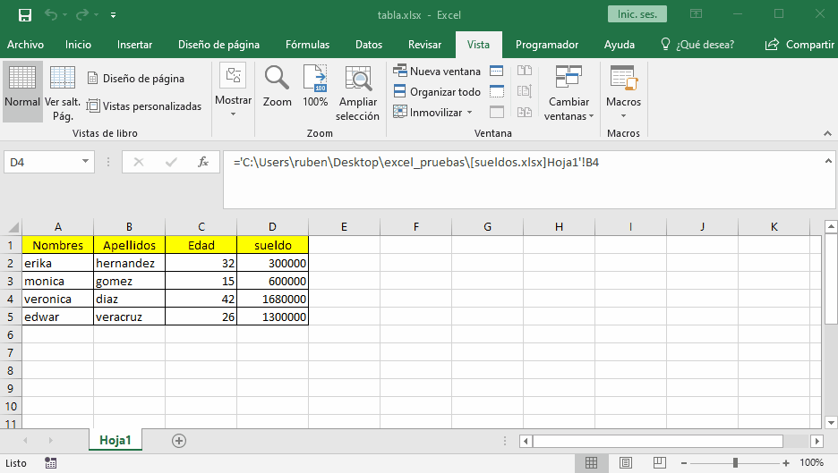
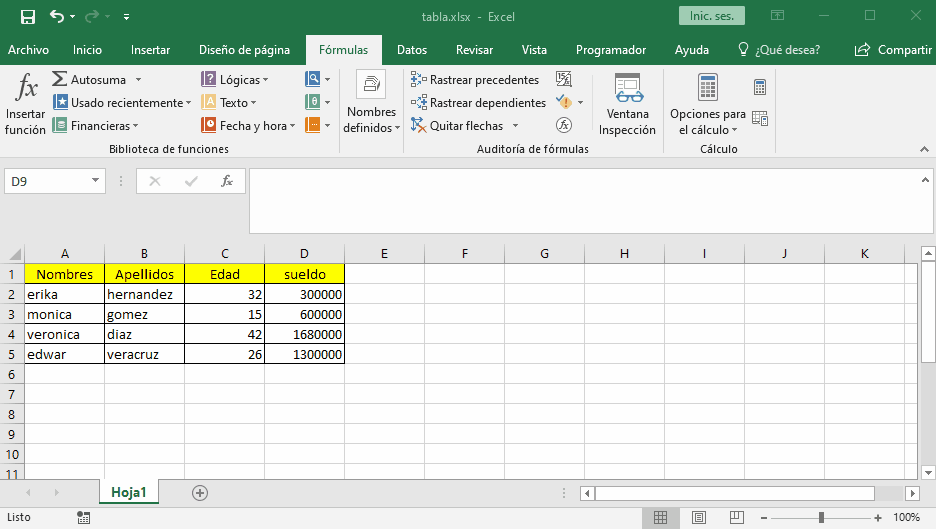

# trabajar con nombres

los nombres nos permite seleccionar un rango de celdas y guardarlas para luego usar el nombre para referirnos a estas celdas haciendo mucho mas facil realizar las formulas ya que usaremos estos nombres en las formulas.

para crear un nombre nos dirigimos a formulas y asignar nombres. aqui crearemos un nombre con el rango que queremos

si deseamos dar nombres a celdas podemos usar `crear desde la seleccion` aqui podemos usar un campo de la fila, de la columna o ambos para nombrar las celdas.

si se usa tanto filas como columnas para nombrarlas se crearan nombres para las columnas como para las filas y para referirnos a una celda tendremos que usar ambos nombres separados por un espacio.

