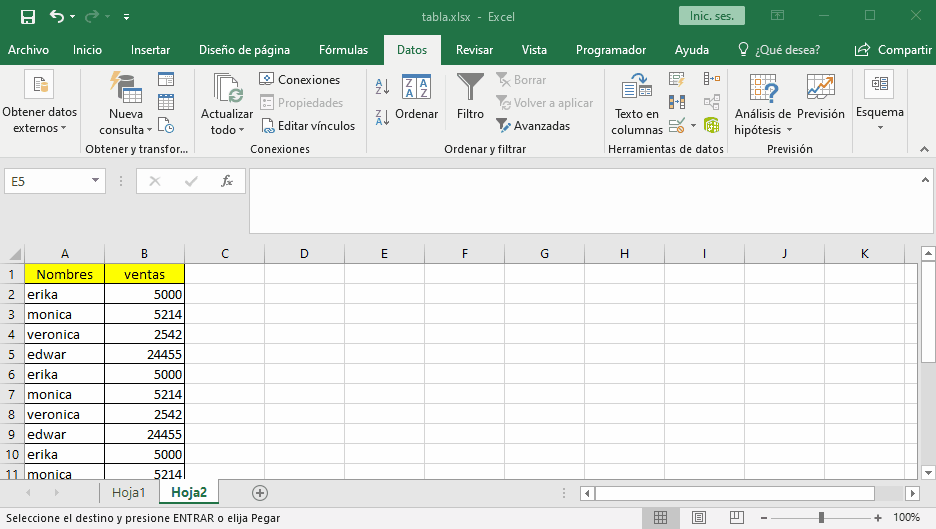

# subtotales

los subtotales nos permite realizar operaciones como suma, promedio entre otras entre un grupo de datos, estos deben estar ordenados en el campo que queremos hacer el subtotal. 

Para lograr hacer los subtotales tenemos que ir a `datos`, `esquema` y `subtotales`

