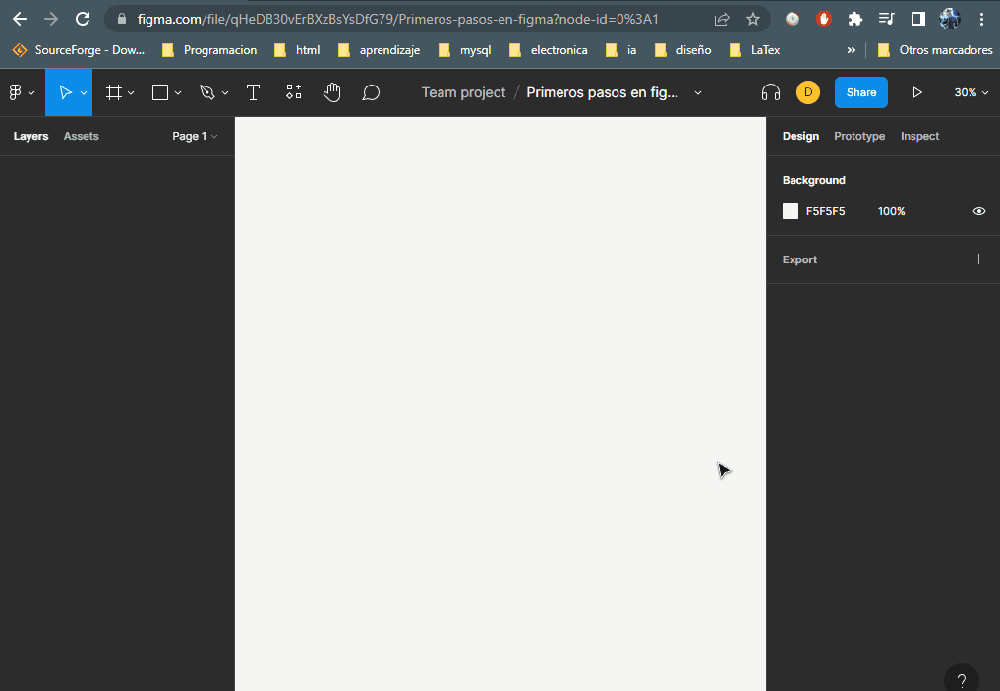

# Frame

lo primero que hay que hacer es crear los contenedores o la resolucion de pantalla que queremos para construir el modelo o el diseño que queremos, con las diferentes vistas. figma nos ofrece algunos modelos.

la tecla para opcion facil es `f`

