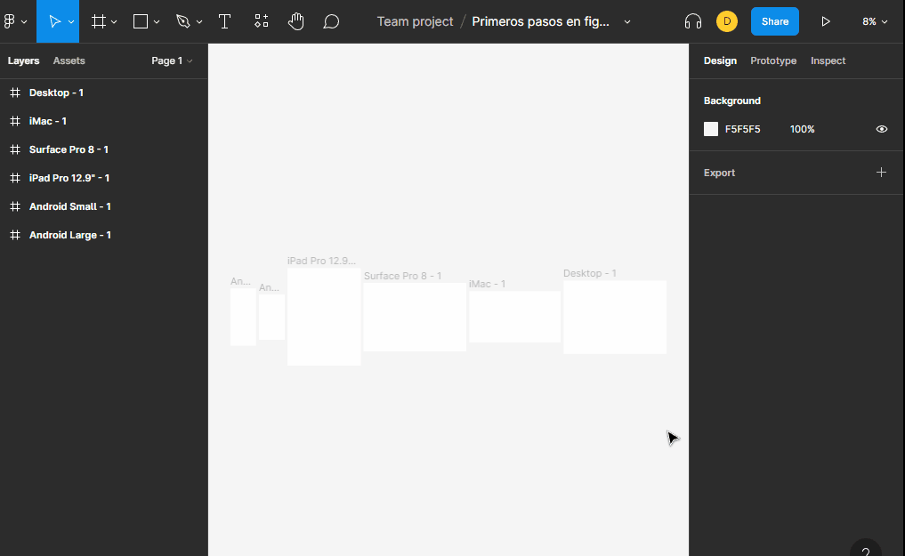

# zoom

para poder acercarnos a un objeto o pasar a una vista de prespectiva tenemos los siguientes comandos.

+ `shift`+`0`= zoom 100%
+ `shift`+1 = zoom panoramico
+ `shift`+2 = zoom al objeto seleccionado

