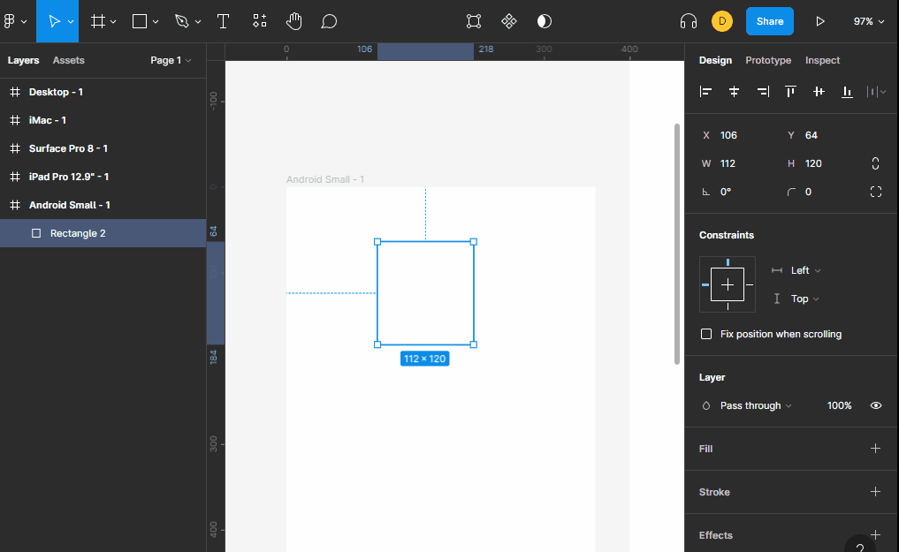

# Objetos

para insertar objetos en el frame seleccionado usamos la herramienta `shape tools` que nos da varios objetos los cuales son:

+ rectangulos `R` 
+ linea `L`
+ flecha `shift`+`L`
+ elipce `O`
+ poligono
+ estrella
+ imagen `ctrl`+`shift`+`K`

**NOTAS**:

+ para cuando usamos algunos objetos podemos usar `shift` para que sea homogeneo, ejemplo un circulo perfecto seria seleccionar el objeto elipce y oprimir shift al momento de crearlo para que se cree un circulo perfecto.
+ podemos usar `alt` para que el objeto comience a crearce desde la posicion del primer click y que este no sea su centro.
+ todos los objetos en su propiedad `fill` puede contener una imagen.
+ para clonar un objeto se puede usar la tecla `alt` y con el mouse mover el objeto esto clonara el objeto

# efectos de color o imagenes

en la propiedad `fill` podemos crear degradados ya sea lineal, radial, angular, diamante o imagen. 

