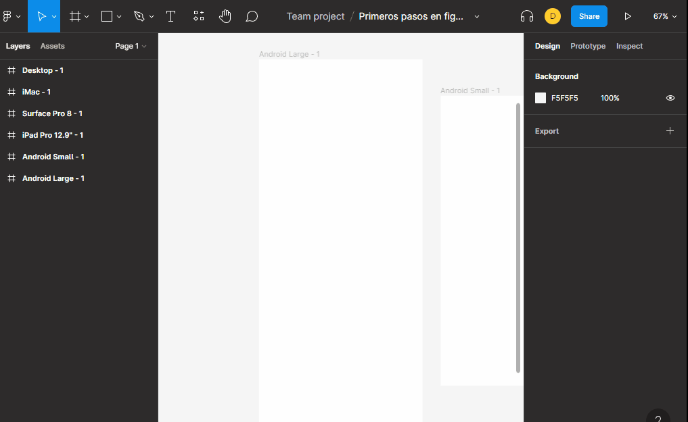

# textos

para poder escribir texto podemos presionar la tecla `T` y podemos cambiarle el tipo de letra por cualquier tipo de letra que se encuentre en `google font`.

en sus propiedades podemos ir jugando para que se adepte a lo queremos.

**Nota**: 

+ podemos usar los iconos de [FontAwesome](https://fontawesome.com/v5/cheatsheet) desde el tipo de letra escribiendo el nombre del icono. 