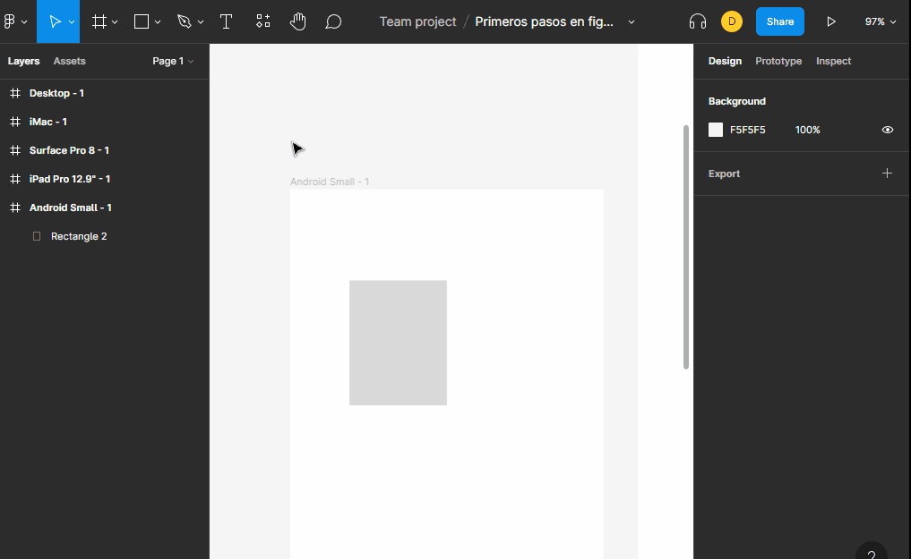

# Reglas

Si no se tienen activa las reglas se debe ir al simbolo de `figma` y dar click en `view` y por ultimo `rulers` o simplemente `shift`+`R`.

una vez activada las reglas podemos arrastrarlas para tener una guia visual y estas se adaptan dependiendo el objeto o el frame que estemos viendo.

para eliminar una guia tendremos que moverla hasta la regla correspondiente a la guia. 

