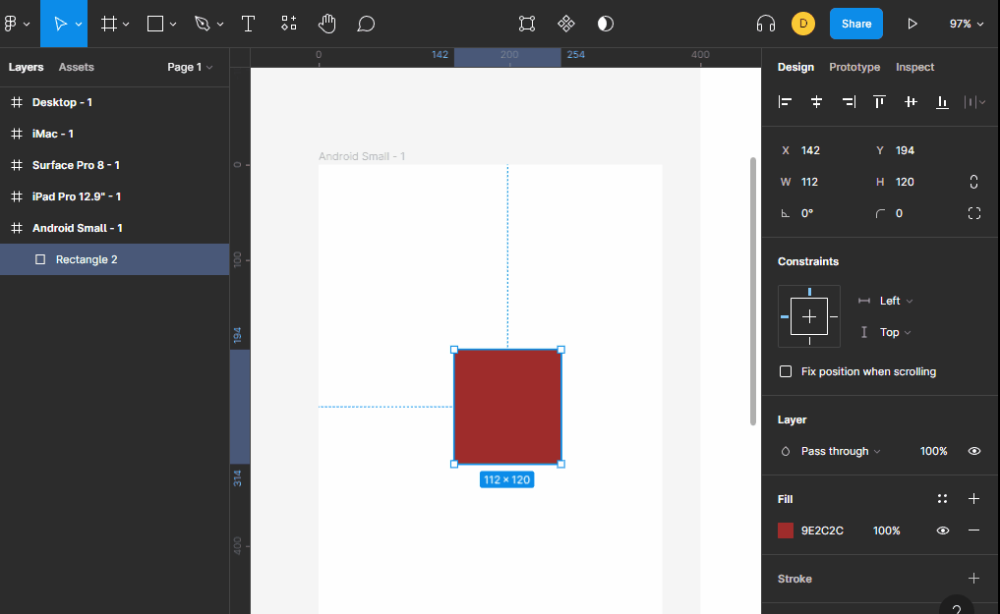

# alineacion

con las propiedades de alineacion podemos posicionar un elemento con respecto a su contenedor. 

podemos posicionarlo arriba, abajo, a la derecha o a la izquierda. tambien podemos decirle al centro en vertical y al centro en horizontal dependiendo la combinacion que usemos podemos situar un elemento a cualquier parte del elemento contenedor.

cuando tenemos varios objetos se activan 3 opciones mas y son las de distribuir en vertical y distribuir en horizontal. **Estas distribuciones se hacen teniendo presente la posicion del primer elemento y la posicion del ultimo elemento.**

