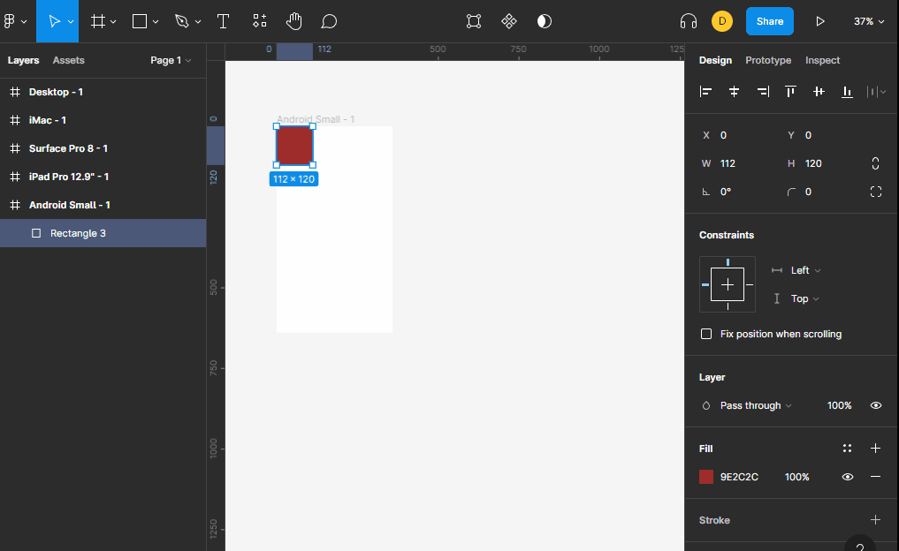

# Constraints

los constraints nos permiten restringir o crear reglas para cuando el objeto contenedor cambia de tamaño, podemos obligar a que un elemento siempre este centrado en la parte superior o hacer que cresca al mismo nivel que crece el contenedor.

los constrains por defecto estan restringidos a `top`, `left`.

