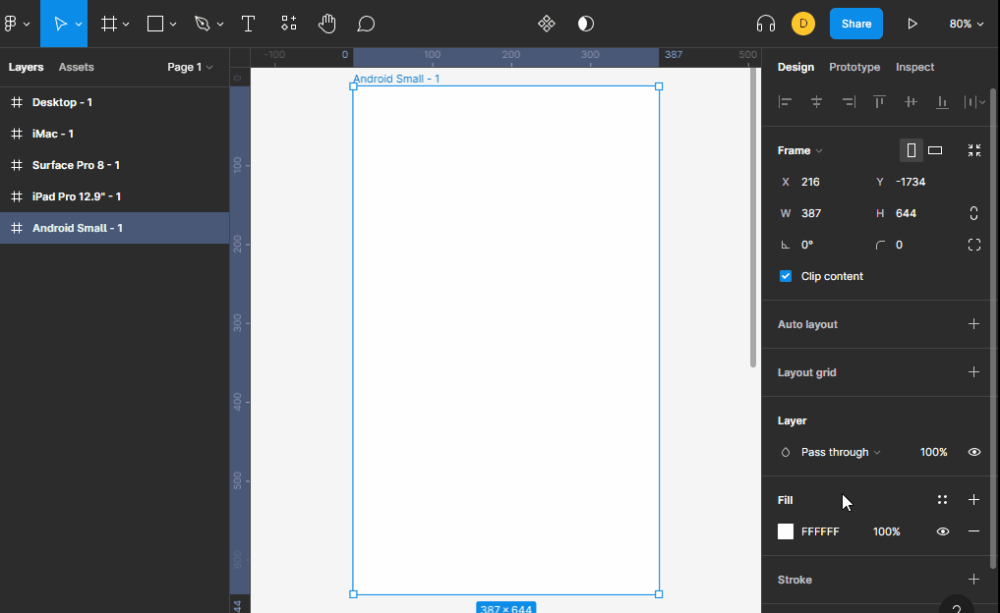

# layout grid

los layout grid nos permite crear guias en el `frame`"" que nos permite hubicar mejor los objetos que queremos que contenga nuestra pagina web. 

normalmente en diseño se usan grid de 12 columnas para posicionar todos los objetos de una forma proporcional.

con el layout grid tenemos tres opciones
+ grid: que nos permite crear cuadros de un tamaño en pixeles predeterminado.
+ columns: que nos permite crear columnas en el frame.
+ rows: que nos permite crear filas en el frame.

dependiendo de nuestra necesidad podemos usar una o otra, o podemos combinar los layouts.

