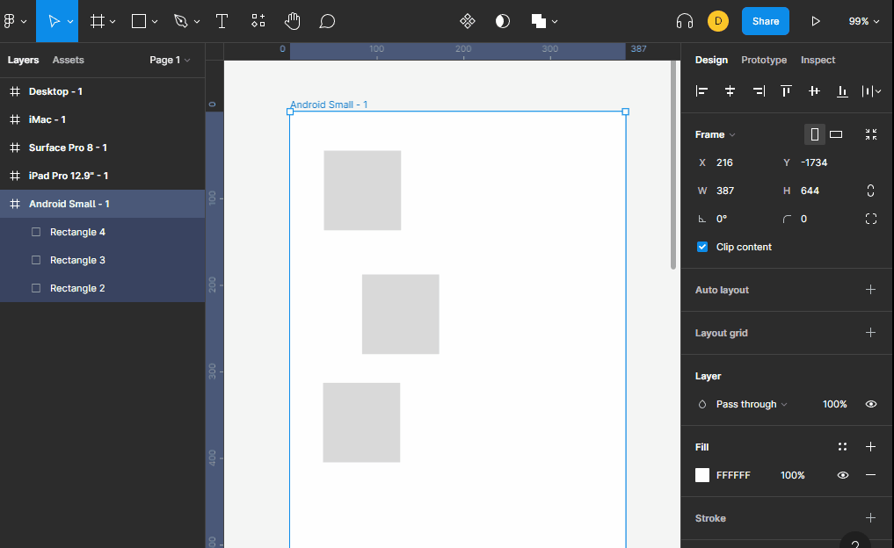

# auto layout

nos permite que el frame se adapte al contenido que le estamos dando **no suele ser obtimo cuando diseñamos para un dispositivo en especifico**, tambien nos sirve para que los elementos que estamos colocando tengan la misma distribucion y es mejor usarlo como agrupadores de elementos.

