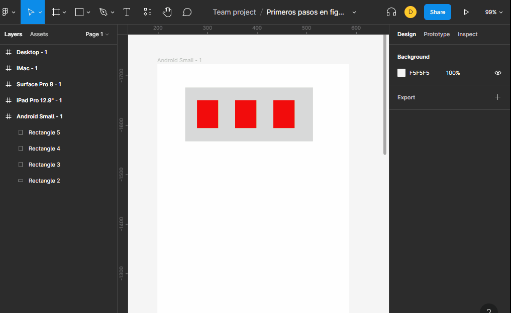

# Grupos y componentes

## Grupos

los grupos nos permite tratar varios objetos como uno, haciendo que sea mas facil su manejo cuando deseamos moverlos.

## componentes

+ nos permite crear un modelo de objeto para que sea reutilizable.
+ podemos hacer cambios en el componente afectando a todas sus copias
+ podemos hacer cambios en las copias sin afectar al componenteo o a otras copias.
+ podemos hacer un cambio en las copias y informar al componente que tome los cambios de la copia.
+ la forma de distinguir el original de la copia es que el original tiene 4 mini rombos mientras las copias solo es un rombo.

