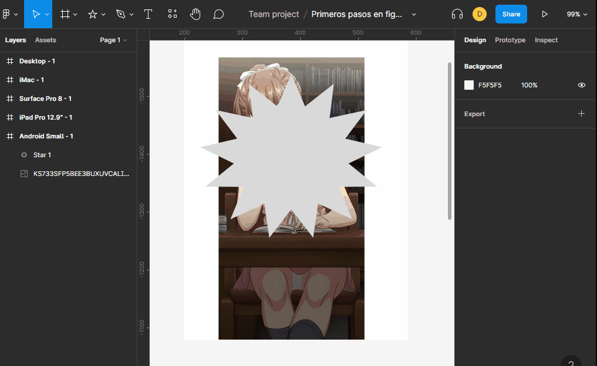
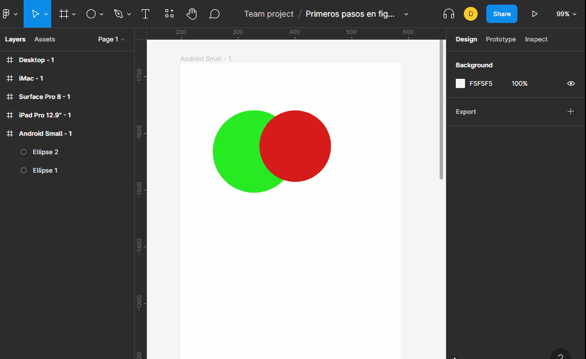

# mascaras

las mascaras nos permiten ocultar una imagen con una forma que nosotros queramos, algo a tener encuenta cuando creamos las mascaras es que la imagen debe estar por ensima de la forma que hara la mascara.

# operaciones booleans

estas operaciones nos permiten crear nuevas formas usando las operaciones:

+ union:
+ sustracion:
+ intersecion:
+ exclusion:

Nota: estas nuevas formas no son reales en otras palabras si se mueve los objetos que las hacen estas cambian