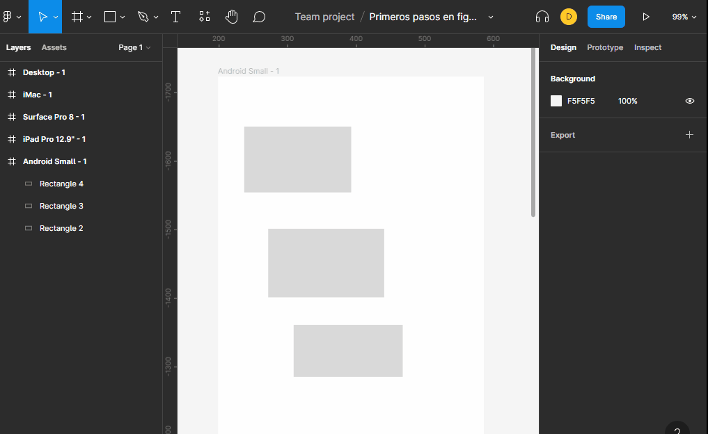

# exportaciones

figma nos permite exportar nuestros diseños a varios formatos como PNG, JPG, SVG y PDF.
+ figma separa los objetos por lo tanto exporta elemento por elemento
+ figma puede exportar todo el contenido de un frame como si fuera solo un archivo.
+ si se quiere exportar una seleccion es necesario usar un `Slice` que permitira este tipo de exportacion.

