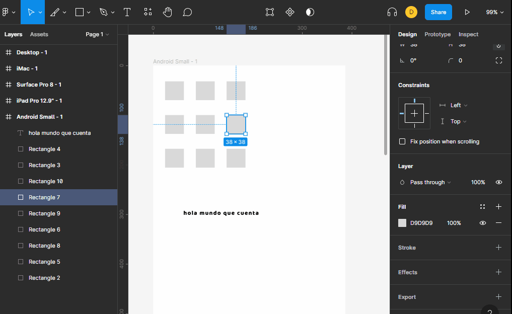
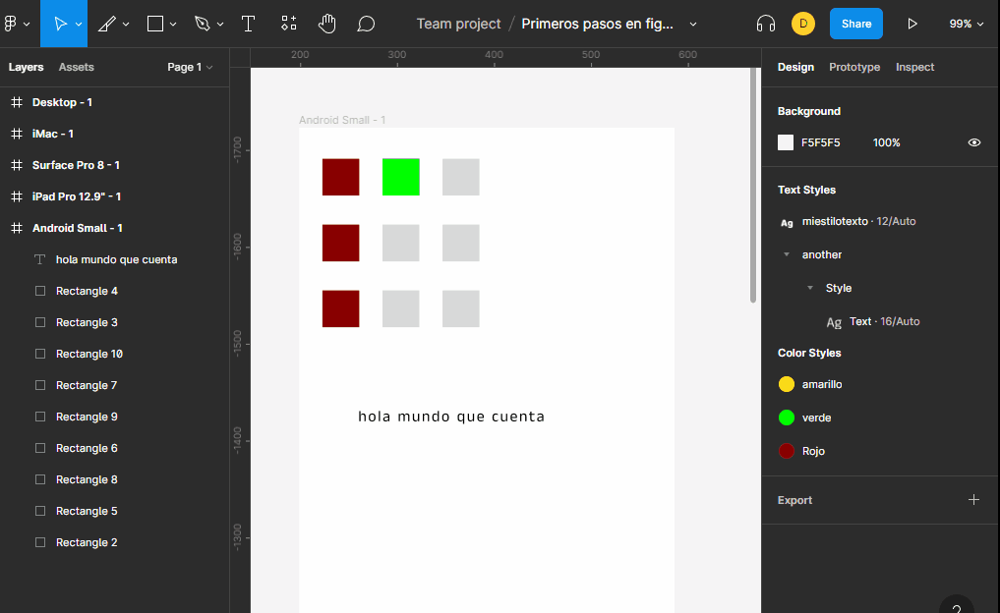

# estilos locales

cuando creamos estilos locales nos permite controlar mejor nuestros diseños ya que si queremos cambiar un color podemos hacerlo a todos los elementos que usen ese color con esto evitamos tener que ir a cada elemento para modificar los estilos.

podemos crear estilos a cada propiedad que contenga un cuadrado de cuatro puntos y darle un nombre significativo se aconseja separar el dato del nombre por `slach` y darle un nombre en ingles ejemplo `color/red/background` 

Se pueden pasar los estilos a una libreria, esta tomara el nombre la la pagina como nombre de libreria y usara esta pagina para guardar los estilos por lo tanto se recomienda hacer una pagina para los estilos que se usaran en todo el proyecto, ademas si se desea modificar algun estilo se debe publicar los cambios y en cada diseño que usa estos estilos se debe actualizar los cambios de la biblioteca.

