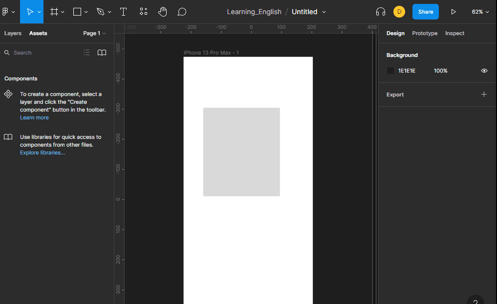

# colaboracion

## compartir archivo

para poder compartir un archivo debemos darle click en `share` aqui nos despliega una ventana emergente que nos permitira compartir nuestro archivo, enviar correo a personas que nos coloboraran con la edicion y permitir un frame para usarlo en otra pagina.

## comentarios

nos permite comunicarnos con el equipo creado para modificar el archivo que estamos haciendo. 

