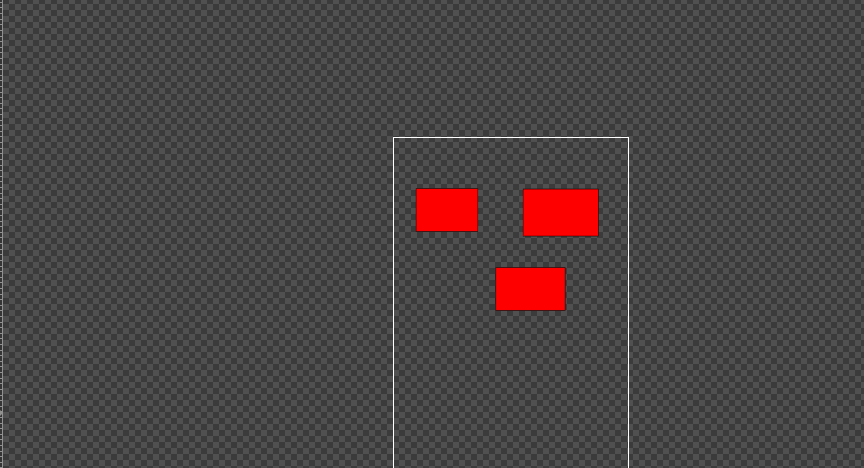
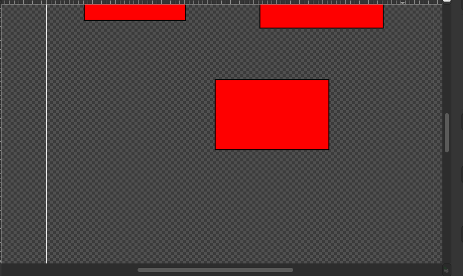

# Zoom

En inkscape podemos hacer zoom con el mouse:

+ `zoom +`: oprimiendo el tercer boton del mouse.
+ `zoom -`: oprimiendo `shift` y el tercer boton del mouse.

## zoom panoramico: 

si queremos acercarnos a una parte en especifico de la imagen usamos zoom panoramico y para poder usarlo  usamos `shift`+tercer boton mouse+seleccionar a lo que queremos hacer panoramico.

## movernos en el documento

podemos movernos de un lado a otro en el documento haciendo click con el tercer boton del mouse y mover el mouse al lugar donde queremos estar.

