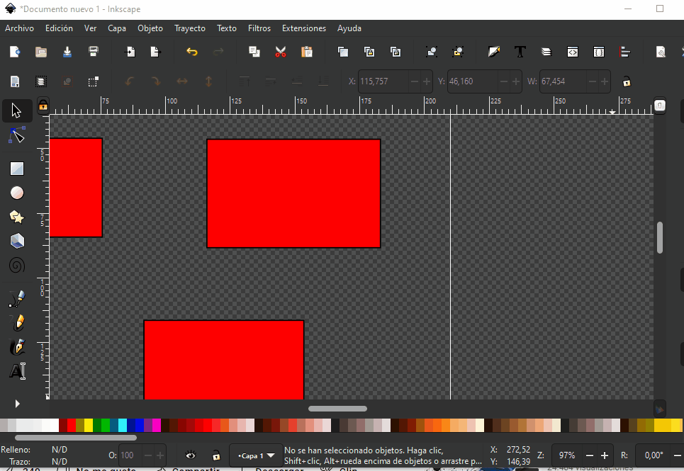

# ajustar imagen al documento

podemos modificar el tamaño del documento, incluso ajustar el lienzo a un dibujo que este desarrollado. 

para esto podemos dar click en `archivo` seguido de `propiedades del documento` en el cuadro que nos sale podemos seleccionar el tamaño del documento que queremos.

Aqui podemos ajustar el lienzo a la imagen.

